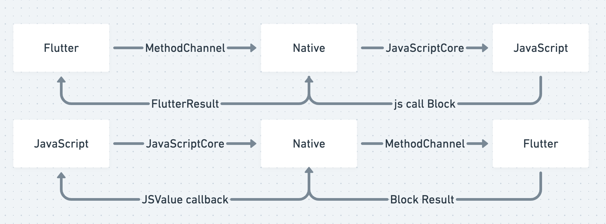
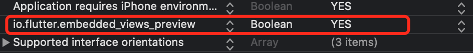
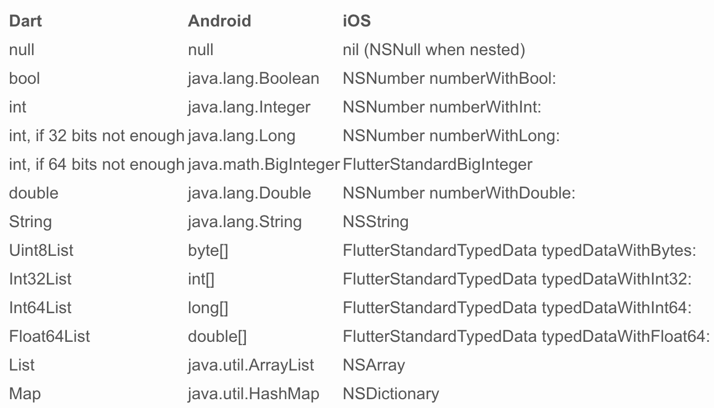
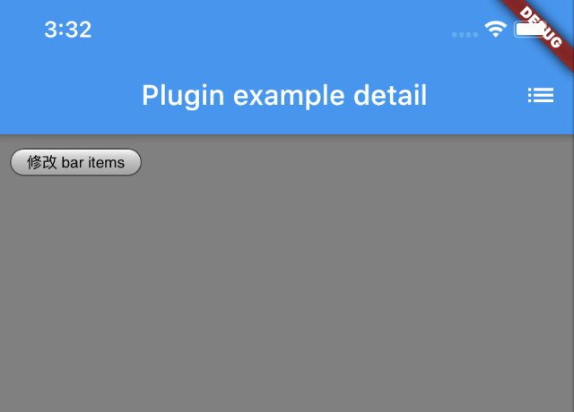
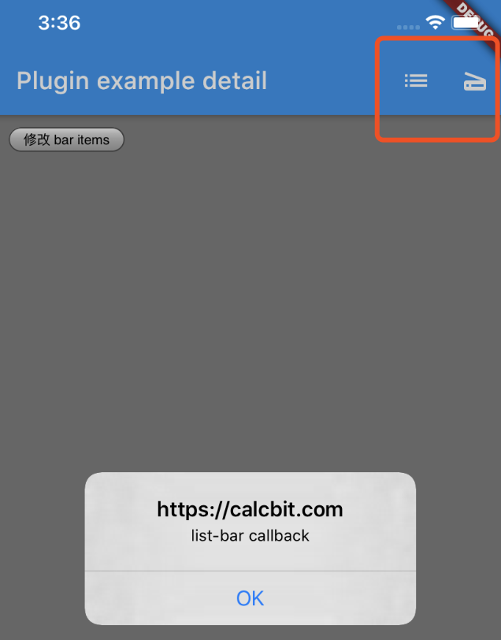

# 基于Flutter的Hybrid Webview容器实践

### 背景
Flutter 是一个 UI 框架，实际开发中除了常见的 widget 还需要如地图、webview等 Native 组件。

一种方法是 Flutter 通知 Native 唤起 Native 界面，如之前的[扫码插件](https://github.com/wayshon/scan_flutter_ios)。缺点是 Native 组件很难和 Flutter 组件进行组合。

第二种是通过 Flutter 提供的 PlatformView(AndroidView/UIKitView) 将 Native 组件嵌入到 Flutter的组件树。使 Flutter 能够像控制普通 widget 那样控制 Native 组件。

**目标: Flutter 中嵌入 webview widget，这个 webview 需要受 flutter 控制，且能够与 flutter 通信。**

### 思路



### 具体实现

#### target 1: 实现 webview 插件
1、创建插件:

```
flutter create -i objc --template=plugin hybrid_webview_flutter
```
自动生成 HybridWebviewFlutterPlugin 类，打开 Runner.xcworkspace

2、在 info.flist 添加 io.flutter.embedded_views_preview: YES。PlatformView 功能默认关闭，不配置这行就没法使用


3、创建 webview 类，实现 FlutterPlatformView 协议，在构造函数里获取 flutter 传递过来的参数，创建 webview，创建 FlutterMethodChannel 并设置 block 回调。

```Objective-C
// 注册flutter 与 ios 通信通道
NSString* channelName = [NSString stringWithFormat:@"com.calcbit.hybridWebview_%lld", viewId];
_channel = [FlutterMethodChannel methodChannelWithName:channelName binaryMessenger:messenger];
__weak __typeof__(self) weakSelf = self;
[_channel setMethodCallHandler:^(FlutterMethodCall *  call, FlutterResult  result) {
	[weakSelf onMethodCall:call result:result];
}];
```

4、创建工厂类 WebviewFactory，实现 FlutterPlatformViewFactory 协议，实现协议中的 createWithFrame 方法并返回步骤3创建的 webview

```Objective-C
//用来创建 ios 原生view
- (nonnull NSObject<FlutterPlatformView> *)createWithFrame:(CGRect)frame viewIdentifier:(int64_t)viewId arguments:(id _Nullable)args {
    //args 为flutter 传过来的参数
    Webview *webView = [[Webview alloc] initWithWithFrame:frame viewIdentifier:viewId arguments:args binaryMessenger:_messenger];
    return webView;
}
```

5、步骤1生成的 HybridWebviewFlutterPlugin 注册插件的方法 registerWithRegistrar 中添加一行注册 WebviewFactory

```Objective-C
[registrar registerViewFactory:[[WebviewFactory alloc] initWithMessenger:registrar.messenger] withId:@"com.calcbit.hybridWebview"];
```

6、根目录 lib/ 下新建 hybrid_webview.dart 文件，创建 HybridWebview Widget，build 返回 UiKitView。UiKitView 接收的 viewType 与步骤5注册 Factory 时的 withId 一致。

creationParams 可传递参数给步骤3。

creationParamsCodec 标准平台通道使用标准消息编解码器，以支持简单的类似JSON值的高效二进制序列化 参考[StandardMessageCodec](https://api.flutter.dev/flutter/services/StandardMessageCodec-class.html)

onPlatformViewCreated 在 UiKitView 创建完成后执行，可获取到 Native 组件的 viewId，注册 MethodChannel，这时候 channel 可与步骤3创建的 webview 进行通信

```dart
Widget buildWebView() {
    return UiKitView(
      viewType: "com.calcbit.hybridWebview",
      creationParams: {
        "url": widget.url,
      },
      //参数的编码方式
      creationParamsCodec: const StandardMessageCodec(),
      //webview 创建后的回调
      onPlatformViewCreated: (id) {
        //创建通道
        _channel = new MethodChannel('com.calcbit.hybridWebview_$id');
        //设置监听
        nativeMessageListener();
      },
      gestureRecognizers: <Factory<OneSequenceGestureRecognizer>>[
        new Factory<OneSequenceGestureRecognizer>(
          () => new EagerGestureRecognizer(),
        ),
      ].toSet(),
    );
}
```


#### target 2: flutter 与 native 通信

##### native 调用 flutter
target 1 步骤3 创建的 FlutterMethodChannel channel 可以调用 invokeMethod 方法传递消息名，参数给 flutter，并设置 flutter 回调

回调参数 result 可能是 flutter Feature 返回值，也有可能是 flutter 运行时报错

##### flutter 调用 native
有了 target 1 步骤 6 onPlatformViewCreated 里创建的 channel，使用 channel.invokeMethod 调用 native 方法，第一个参数为消息名，第二个为可选参数。返回一个 Future（类似 js 的 Promise）

在 target 1 步骤 3 OC 创建 FlutterMethodChannel 时的 block 可接收到 flutter 的调用信息。第一个参数 FlutterMethodCall 包含了 flutter 调用的消息名与参数，第二个参数 FlutterResult 是一个回调函数，传递给 flutter 返回值。

为了扩展性，这里将 invokeMethod 的第一个参数固定为 `__flutterCallJs`，第二个参数固定为数组，数组第一个参数固定为 js 的目标方法。这样只是用 `__flutterCallJs` 就不用每增加一个方法就去修改 native 的代码。  
Native 调 flutter 的消息名不固定是因为我们能够经常修改 flutter，但是不会经常修改 native

```Objective-C
-(void)onMethodCall:(FlutterMethodCall*)call result:(FlutterResult)result{
    if ([[call method] isEqualToString:@"__flutterCallJs"]) {
        NSString *action = [call.arguments firstObject];
        NSArray *params;
        if ([call.arguments count] > 1) {
            params = [call.arguments subarrayWithRange:NSMakeRange(1, [call.arguments count] -1)];
        } else {
            params = @[];
        }
        //  在主线程更新 webview，不然会崩
        dispatch_async(dispatch_get_main_queue(), ^{
            [self->_context[@"__flutterCallJs"] callWithArguments:@[action, params, ^(JSValue *value) {
                NSArray *arr = [value toArray];
                result(arr);
            }]];
        });
    } else if ([[call method] isEqualToString:@"evaluateJavaScript"]) {
        // 注入 js
        NSString* jsString = [call arguments];
        dispatch_async(dispatch_get_main_queue(), ^{
            [self->_webView stringByEvaluatingJavaScriptFromString:jsString];
        });
    }
}
```

下图列举了 native 与 flutter 值的转换


通过实践限制 flutter 调 oc 限制的参数为 bool, int, double, string,List, Map, Null  
Set不能传会报错，map 的 key 必须为 string，不然 flutter 传给 OC 没问题，OC传给 js 的时候会剔除掉。如 {'a':1,2:2} 传到 js 就变成了 {'a':1}


#### target 3: webview 与 native 通信

##### native 调用 js
在 target 2 中 OC 已经能够接收到 flutter 传递过来的消息，这时候 OC 需要将消息传给 js。可以通过 KVC 获取到 UIWebView 的 JSContext（WKWebView取不到context但是可以通过消息形式）

在 webview 定义全局函数 `__flutterCallJs` 用来接收 OC 传递过来的值。

JSContext 执行 `__flutterCallJs` 透传 flutter 传过来的参数，并多传一个 block 参数，block 在 js 里会变成函数，js 侧调用这个函数类似 callback

OC 的 block 接收到 js 执行的回调，调用 FlutterResult，将回调结果返回给 flutter

除了获取 js context 执行 js，webview 常见的还有注入 js，可以接收 flutter 传来的 js string 注入到 webview

##### js 调用 native
1、JSContext 直接注入 bolck，js 调用这个函数

```Objective-C
_context[@"globalFuction"] = ^(JSValue *value) {
	NSLog("%@", value);
};
```

2、通过 JSExport 协议，只有 JSExport 里声明的方法才会被 js 访问到

定义一个 JSExport 协议，并在 Class A 实现，将 A 实例化并作为全局变量注入到 JSContext，这里为了方便直接在 webview 定义实现 JSExport，将 当期实例 self 注入到 JSContext

```Objective-C
//定义一个JSExport protocol
@protocol JSExportProtocol <JSExport>
	JSExportAs(jsCallFlutter, - (void)jsCallFlutter:(JSValue *)action params:(JSValue *)params callback:(JSValue *)callback);
@end

//将self添加到context中
_context[@"__OCObj"] = self;
};
```

这时候 js 全局链就会有 `__OCObj` 对象，调用 __OCObj.jsCallFlutter 传递参数给 OC，约定 最后一个参数为 callback，js Function 到 OC 里面会转换成 block

OC 通过 FlutterMethodChannel 调用 flutter 获得返回值后通过这个 block 触发 js 的 callback

```Objective-C
#pragma mark - jsExport
- (void)jsCallFlutter:(JSValue *)action params:(JSValue *)params callback:(JSValue *)callback {
    NSString *actionName = [NSString stringWithFormat:@"%@", action];
    NSArray *arr = [params toArray];
    [self->_channel invokeMethod:actionName arguments:arr result:^(id  _Nullable result) {
        if ([result isKindOfClass:[NSClassFromString(@"FlutterError") class]]) {
            [callback callWithArguments:@[[result valueForKey:@"_message"], [NSNull null]]];
        } else {
            id results;
            if (result) {
                results = result;
            } else {
                results = [NSNull null];
            }
            //  在主线程更新 webview
            dispatch_async(dispatch_get_main_queue(), ^{
                [callback callWithArguments:@[[NSNull null], results]];
            });
        }
    }];
}
```

经实践，限制 js 传给 OC 的值为 boolean, number, string, array, obj, null/undefined

null/undefined 都会转成 null，fn/set/map都会在OC变成空字典 {}，{1: 'a'} 到了 OC key 也会转成 string

#### target 4: cookie 共享
webView/OC，RN/OC cookie 都是共享的。但是 flutter 比较奇怪，用过的 dart:io 与 [dio](https://pub.flutter-io.cn/packages/dio) 都不自动带上cookie，查看了 [dio_cookie_manager](https://pub.flutter-io.cn/packages/dio_cookie_manager) 与 [cookie_jar](https://pub.flutter-io.cn/packages/cookie_jar) 的实现，发现 dio 是利用这两个库自己在 dart 维护了 cookie 信息，然后添加到 dio.interceptors 里，随 request 带上，监听 response 存储。

```dart
// dio & dio_cookie_manager 代码
Future onRequest(RequestOptions options) async {
    var cookies = cookieJar.loadForRequest(options.uri);
    cookies.removeWhere((cookie) {
      if (cookie.expires != null) {
        return cookie.expires.isBefore(DateTime.now());
      }
      return false;
    });
    String cookie = getCookies(cookies);
    if (cookie.isNotEmpty) options.headers[HttpHeaders.cookieHeader] = cookie;
  }
  @override
  Future onResponse(Response response) async => _saveCookies(response);
  _saveCookies(Response response) {
    if (response != null && response.headers != null) {
      List<String> cookies = response.headers[HttpHeaders.setCookieHeader];
      if (cookies != null) {
        cookieJar.saveFromResponse(
          response.request.uri,
          cookies.map((str) => Cookie.fromSetCookieValue(str)).toList(),
        );
      }
    }
  }
```

由于这种实现相当于把 response 的 cookie 维护在 dart 层面，所以 OC 的请求就不会有这些信息，webView 环境也不会有。

然后？  


与其将 cookie 信息维护在 dart，为什么不直接维护在 OC，那样OC/webView的请求还能带上。

##### 方案
- OC 与 webView 的 cookie 是互通的，不用手动处理
- dart req/res 调用 MethodChannel 读/存 cookie
- OC 存 cookie 至 NSHTTPCookieStorage，并同步至 webView 的 document.cookie

##### 实现
1、 dart 存取 cookie 存到 OC

```dart
  // 存
  static Future<bool> setCookie({ String domain, String name, String value, int exp }) async {
    bool result = await _channel.invokeMethod('setCookie', [domain, name, value, exp]);
    return result;
  }
  // 取
  static Future<List<Map>> getCookie(String url) async {
    final List res = await _channel.invokeMethod('getCookie', url);
    List<Map> listMap = new List<Map>.from(res);
    return listMap;
  }
```

2、OC 存取 dart 传过来的值，并在 OC 发送请求时带上这些 cookie

```Objective-C
// 读 cookie
NSArray *cookieArray = [NSArray arrayWithArray:[[NSHTTPCookieStorage sharedHTTPCookieStorage] cookies]];

// 存 cookie
NSHTTPCookie *cookie = [NSHTTPCookie cookieWithProperties:cookieProperties];
[[NSHTTPCookieStorage sharedHTTPCookieStorage] setCookie:cookie];

// 请求带上 cookie
NSDictionary *cookieHeaderDic = [NSHTTPCookie requestHeaderFieldsWithCookies:[[NSHTTPCookieStorage sharedHTTPCookieStorage] cookies]];
[request setValue:[cookieHeaderDic objectForKey:@"Cookie"] forHTTPHeaderField:@"Cookie"];
```

3、OC 接收到 dart 传过来的 cookie 时顺带将 cookie 写入 webView

```Objective-C
 NSString *jsStr = [NSString stringWithFormat:@"document.cookie='%@=%@;expires=%ld'",name,value,exp];
[_webView stringByEvaluatingJavaScriptFromString:jsStr];
```

### 实践应用
WebView 控制 flutter 导航栏右侧 BarButtonItem

- js 传递配置数组给 flutter，将 callback 存储在 js
- flutter 根据配置渲染 AppBar actions，设置点击回调将按钮类型回传 js
- js 根据 flutter 传过来的值调用之前缓存的 callback，调用结果返回给 flutter




### 写在最后
Flutter 里跑 webview 显然不是明智的做法，flutter 官方默认都关闭 PlatformView 功能。  
相对于 hybrid 和 RN 只有 JSC 通信，这里的 webview 又多了一层 flutter 通信。  

但是特殊场景下也不是不可以这么玩。类似在 RN / 小程序 里跑webview，在小程序里套 webview 减小包体积，避开审核快速迭代的做法不在少数。

也有在微信小程序里利用 miniprograme.navigateTo 触发app.pageNotFound 做 IOC 的，虽然慢了点绕了点，但是提高了开发效率与迭代速度。

  
**Anyway, Keep Balance.**

#### 题外话 - 作为页面仔我们做跨端的优劣势
<del>怕被砖，先声明以下为纯扯淡内容</del>  

###### 优势
- 快，一次开发到处跑，对比安卓一堆机型一堆特殊 api，固定 webview 内核简直美滋滋
- 快，hotreload爽的不行
- 快，增量热更新绕过审核
- 快，开发体验，MVVM，声明式开发加上组件库简直拼积木，iOS 命令式开发连尾灯都看不到
- 快，CSS 牛逼，Android 还得整 xml，iOS 更是惨到手写代码布局
- 快，开发环境简单，node / web 一把梭，native 一堆奇奇怪怪的配置

###### 劣势
- 慢，能力限制在 webview 的环境里，webview 限制了上限，扩展功能需要 native 排期施舍
- 慢，单线程，渲染还会互斥，仰仗 native 帮忙分拆逻辑线程和UI线程进行优化
- 慢，JIT 干不过 AOT
- 慢，渲染干不过 native，多了层中间商 webview 赚差价，无限列表 webview 连 native 的尾灯都看不到
  - native 渲染: view -> layout -> renderNode -> 合成 -> GPU渲染
  - webview: html -> dom tree -> render tree -> render layer -> 合成 -> gpu渲染

PS: 听说 flutter 很强，但它并不是前端专属玩具，因为 native 上手更有优势（尤其 Android）  


综上，***快*** 才是我们的优势啊，钻牛角尖跟 native 比性能，何必呢。  


